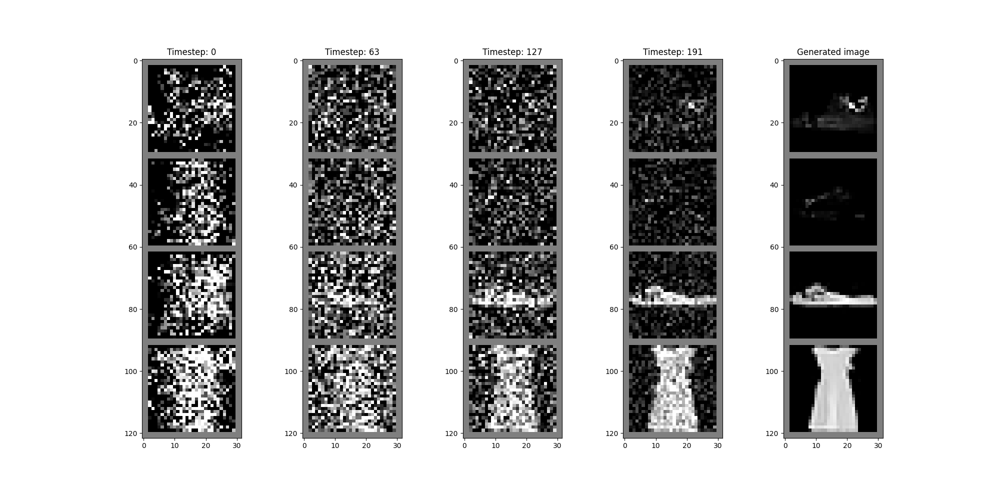
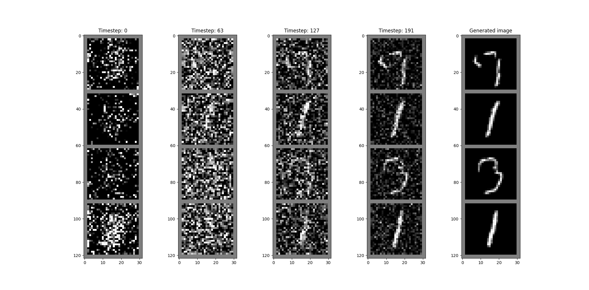
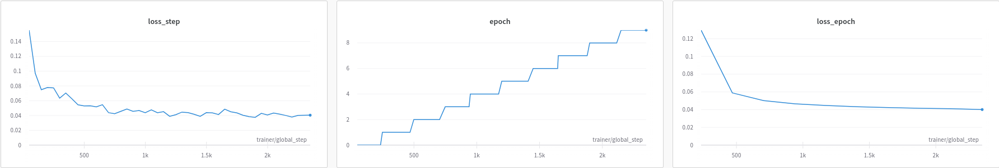

# Annotated Diffusion

Reproducing https://huggingface.co/blog/annotated-diffusion

### Example outputs:




### Training
To run training:
```sh
python train.py hydra.job.chdir=False --config-name <config>
```
**hydra.job.chdir=False** - disables hydra from changing working directory \
**--config-name** flag is used to specify config name, it needs to be in **configs** directory

Training on MNIST for 10 epochs:


### Sampling
Here is example snippet for sampling from mnist trained model

```python
import torch
import matplotlib.pyplot as plt
import argparse
import torchvision

from models.reverse_diffusion import Unet
from models.forward_diffusion import ForwardDiffusion
from models.utils import Transforms

from sample import Generator

if __name__ == "__main__":
    # argument for checkpoint path
    parser = argparse.ArgumentParser(prog="sampling-test")
    parser.add_argument("--ckpt_path", type=str)
    args = parser.parse_args()

    transform = Transforms(28)

    check = torch.load(args.ckpt_path)

    model = Unet(32, (1, 2, 4), in_channels=1, resnet_block_groups=4)
    forward_diffusion = ForwardDiffusion(0.0001, 0.02, timesteps=256, schedule_type="cosine")

    model.load_state_dict(check["model"])
    forward_diffusion.load_state_dict(check["forward_diffusion"])

    gen = Generator(model, forward_diffusion)

    noise = torch.randn((4, 1, 28, 28))
    imgs = gen.sample(noise, intermediate_imgs=True)


    # idx for plotted intermediate image
    plotted_imgs_idx = [0, 63, 127, 191, 255]
    grid_imgs = [torchvision.utils.make_grid(imgs[i], nrow=1) for i in plotted_imgs_idx]
    # imgs_transformed = [transform.torch2img(imgs[i].squeeze(0)) for i in plotted_imgs_idx]
    imgs_transformed = [transform.torch2img(grid_img) for grid_img in grid_imgs]


    fig, axes = plt.subplots(1, len(plotted_imgs_idx), figsize=(20, 10))

    for i, ax in enumerate(axes):
        ax.imshow(imgs_transformed[i], cmap="gray")

        if plotted_imgs_idx[i] != 255:
            ax.set_title(f"Timestep: {plotted_imgs_idx[i]}")
        else:
            ax.set_title("Generated image")

    plt.show()
```

### Code Style

This repository uses pre-commit hooks with forced python formatting ([black](https://github.com/psf/black),
[flake8](https://flake8.pycqa.org/en/latest/), and [isort](https://pycqa.github.io/isort/)):

```sh
pip install pre-commit
pre-commit install
```

Whenever you execute `git commit` the files altered / added within the commit will be checked and corrected.
`black` and `isort` can modify files locally - if that happens you have to `git add` them again.
You might also be prompted to introduce some fixes manually.

To run the hooks against all files without running `git commit`:

```sh
pre-commit run --all-files
```
